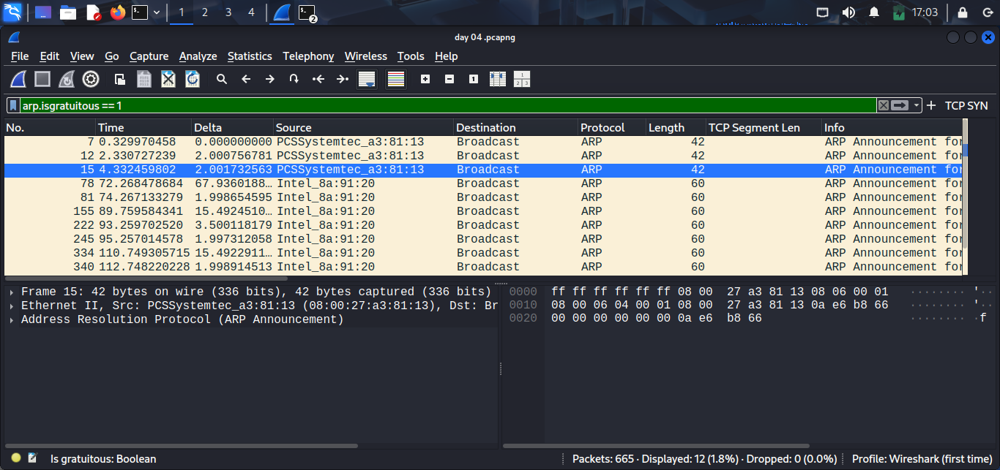
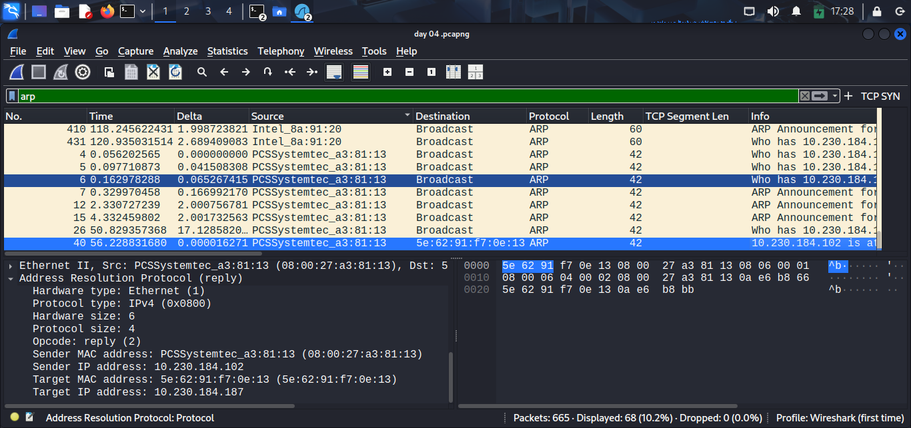

## What I Concluded
ARP is pure trust: any host can announce an IP-to-MAC mapping and other devices just accept it. In my capture I saw normal request/reply traffic plus gratuitous ARP announcements, which proves updates can happen without anyone asking. That is useful for legit changes, but it also means a spoofed announcement would look the same at this layer.

**Gratuitous ARP announcements captured:**

## Assumption I Made
I assumed ARP replies only show up after a request, but the gratuitous ARP traffic showed updates can be pushed without a request.

**Normal ARP request/reply exchange:**

## Uncertainty I Have
I am still not sure how to reliably separate legitimate gratuitous ARP (DHCP changes, VM MAC changes, failover) from malicious spoofing just by passively watching packets.

## PCAP File
The raw packet capture used for this analysis is available at:
- `pcap-samples/day04-arp-baseline.pcap`

You can open this in Wireshark to repeat the analysis or apply additional filters.
