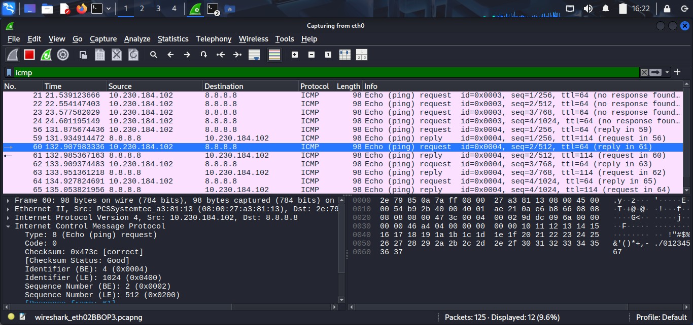
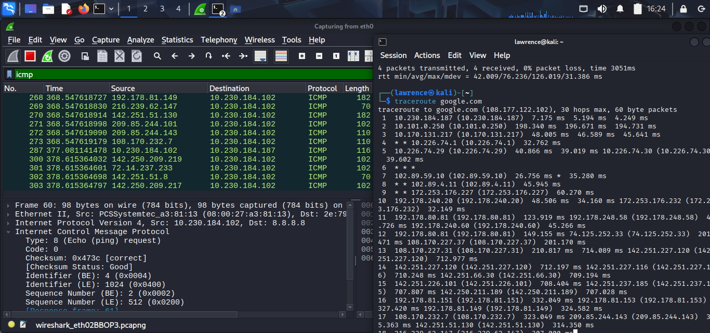
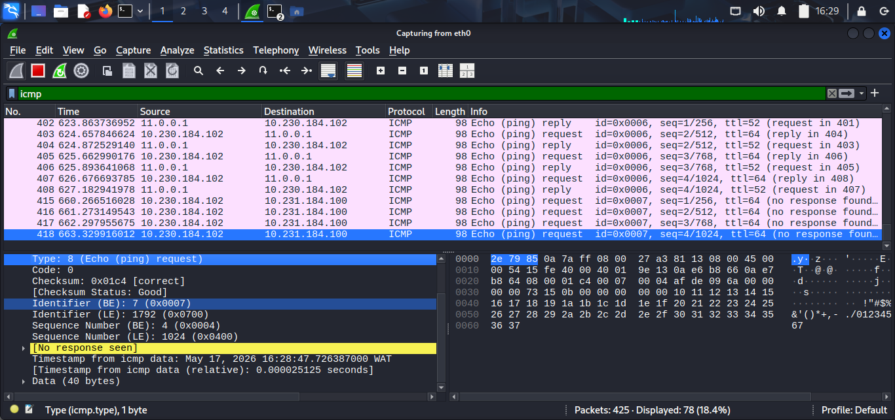
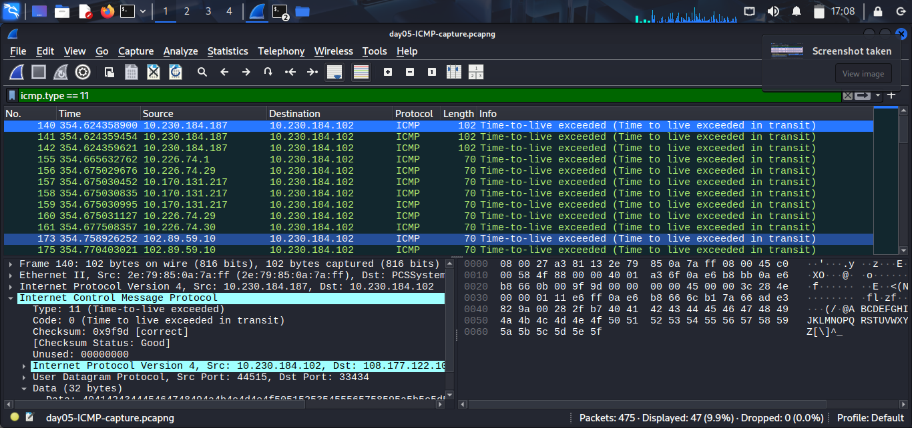

# Day 5 — ICMP: More Than Just Ping

## What I Concluded

ICMP is not just ping. I knew that going in but I didn't actually understand it until I ran the three scenarios.

**Scenario 1 — normal ping to 8.8.8.8:**
Got all 4 replies back. Clean Type 8 requests and Type 0 replies. Payload size came out at 40 bytes on my Kali setup — not the textbook 56 bytes Linux is supposed to default to. That's my actual baseline. If I ever build a detection rule it has to account for 40 bytes, not what the documentation says.



**Scenario 2 — traceroute to google.com:**
Got around 19 hops. Filtered by `icmp.type == 11` in Wireshark and counted the unique source IPs. Each one is a router that dropped my packet and sent back a Time Exceeded message. That's how traceroute actually works — it's not measuring the route directly, it's collecting error messages from every router along the way. 19 hops from Nigeria to Google makes sense given the international routing involved.



**Scenario 3 — ping a non-existent host on my LAN:**
Expected to see Type 3 Destination Unreachable. Got silence. At first I thought something was wrong with my capture. It wasn't. The machine sent an ARP request first trying to find the host at Layer 2. Nobody replied. So the ICMP packet never even got sent. Nothing to reply to. Silence is the answer.



The difference between silence and Type 3 matters in a SOC context. Silence means ARP failed — the host was never found at Layer 2. Type 3 means the packet reached the router and the router actively rejected it. Same symptom on the surface, completely different story underneath.

**ICMP Tunneling:**
Data gets hidden inside the payload field of Echo Request packets. Normally that field is just padding. Tools like ptunnel replace the padding with real data — commands, files, whatever needs to move. Firewalls see ping traffic and let it through. The detection signals are payload size way above baseline, sustained high frequency traffic, and payload content that looks structured instead of random.

My detection filter:
```
icmp.type == 8 && data.len > 64
```



That catches Echo Requests with payloads above both the Linux and Windows defaults. The threshold needs tuning per network because my own baseline is already 40 bytes not 56 — a blanket rule without baselining first would be useless.

## Assumption I Made

I assumed my Linux ping would follow the documented default of 56 bytes. It didn't — mine came out at 40 bytes on both the local ping and pinging 8.8.8.8. That told me you can't copy detection thresholds from documentation and call it done. You have to measure your actual environment first and build rules from that, not from what the textbook says the default should be.

## Uncertainty I Have

I still don't fully understand what determines the payload size difference. Is it the Kali version, the VM network stack, or something in how VirtualBox handles the packets? I don't know yet. Next I want to compare payload sizes between a physical machine and a VM running the same OS to see if virtualisation is the variable. That would tell me whether my 40 byte baseline is a Kali thing or a VM thing — and that matters for building accurate detection rules.
