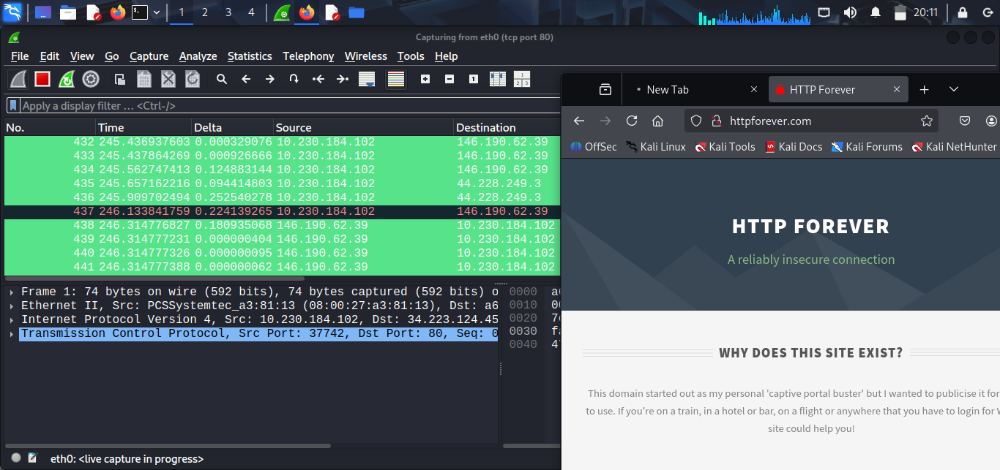
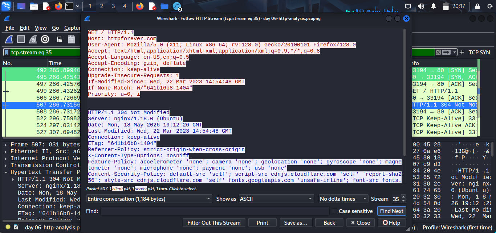
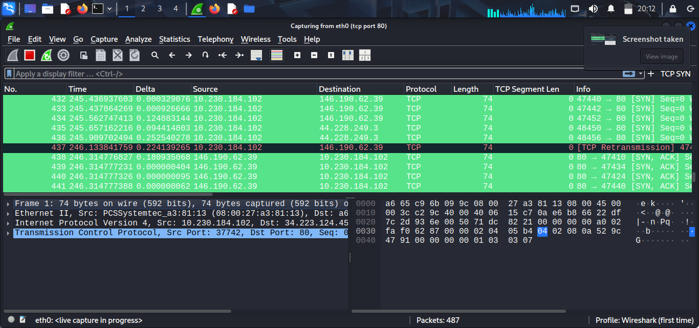

# Day 06 — HTTP Request Anatomy: Reading What Users Actually Send

## What I Concluded

So for this one I decided to step up from the previous days. Instead of using a display filter I went straight with a capture filter — `tcp port 80`. By now I already know what normal traffic looks like so there was no point capturing everything and filtering later. I just captured what I needed.

I visited five sites — neverssl.com, example.com, httpforever.com, and two others. `testphp.vulnweb.com` didn't open at all which is actually something worth noting — a site designed for security testing being unreachable means I couldn't do that part of the exercise. I'll come back to it.

The most useful thing I did was Follow HTTP Stream on httpforever.com. That single view showed me everything — the full request and full response in one window. Here's what I found:

**Method:** GET — browser asking for the homepage. Nothing special but it confirms the connection was plain HTTP, no encryption, everything readable.

**User-Agent:** `Mozilla/5.0 (X11; Linux x86_64; rv:128.0) Gecko/20100101 Firefox/128.0`

That one line tells anyone watching exactly what OS I'm running (Linux x86_64) and the exact browser version (Firefox 128). I didn't set that. Firefox sent it automatically on every single request. Any server or anyone intercepting the traffic now knows my setup without me doing anything.

**Cookies:** None across all five sites. No `Set-Cookie` in any response, no `Cookie` header in any request. That's because these were all first visits on a clean browser session. In a real scenario with logged-in accounts or returning visits, cookies would be flying back and forth in plain text — fully readable to anyone on the same network.

**PII in URL:** None. All requests were clean `GET /` with no query parameters. But the point stands — if any of these sites had a search bar or login form sending data over HTTP, that data would show up right there in the GET request line for anyone capturing traffic to read.

**304 Not Modified:** The response from httpforever.com wasn't even the full page — it was a `304` telling Firefox "you already have this cached." That means Firefox had visited before and sent `If-None-Match` and `If-Modified-Since` headers to check. A SOC analyst seeing those headers on an unfamiliar machine knows that machine has visited that site before — useful for building a timeline during an investigation.

**TCP Retransmission:** I also spotted a retransmission packet (packet 437) in the capture — a packet got lost and was resent. Normal on a home network but in a SOC context repeated retransmissions from one host can indicate network issues or an overloaded connection worth investigating.

The biggest takeaway from today is that plain HTTP is genuinely dangerous. Everything I saw in that Follow HTTP Stream window — User-Agent, headers, response body — is exactly what a man-in-the-middle attacker on the same network would see. No tools needed. Just Wireshark and a capture filter.

## Assumption I Made

I assumed that visiting five different sites would give me a variety of cookie and PII examples to document. That wasn't true — none of the sites I visited showed cookies and none had PII in the URLs. That's because the sites I picked were intentionally simple HTTP test sites with no login or session management.

The exercise would look very different on a real HTTP site with user accounts. The cookies and PII are there in real traffic — I just need a better target. I'll revisit this with `testphp.vulnweb.com` when it's back online.

## Uncertainty I Have

I still want to understand the `If-None-Match` and `If-Modified-Since` headers better. I get that they're cache validation — Firefox is telling the server "here's what I have, has anything changed?" But I don't fully understand how an analyst uses that in an investigation beyond knowing the client has visited before. Is there a way to use the ETag value to track a specific browser across different captures? That's what I want to find out next.
