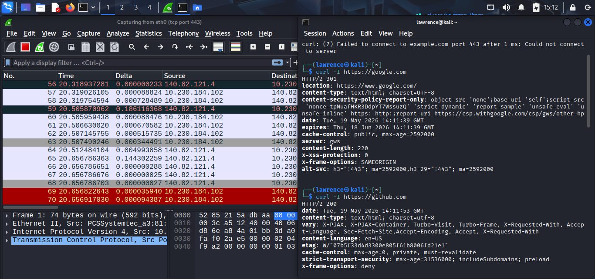
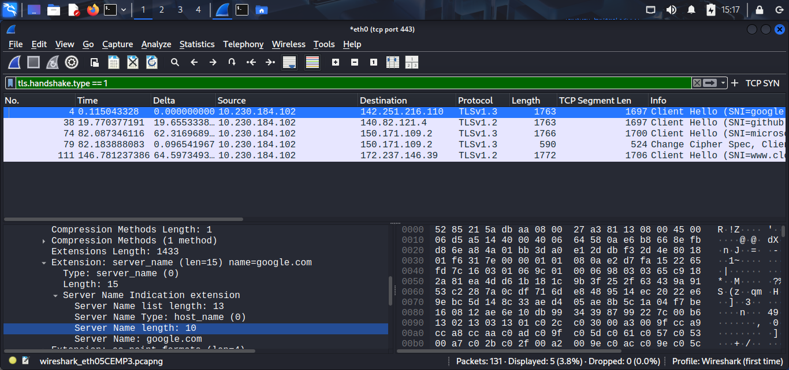
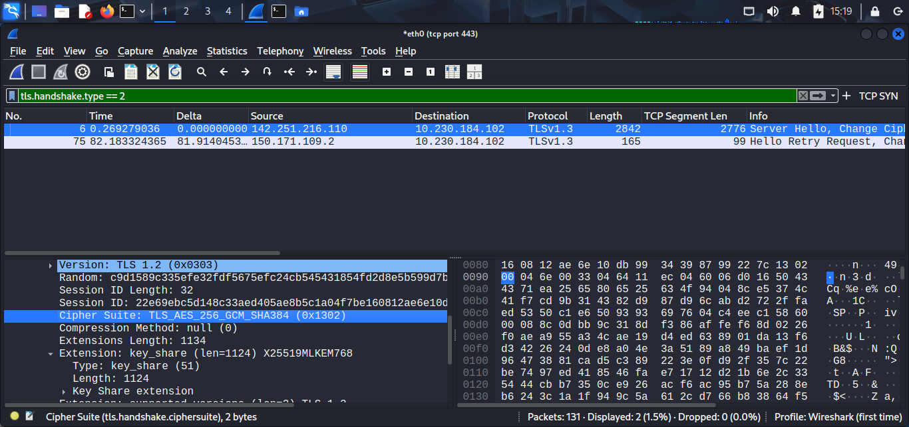

# Day 07 — HTTPS/TLS: What You Can't See and What You Can

## What I Concluded

So this one was different than the previous days. I'm not trying to break anything or watch for specific packet patterns. I'm looking at encrypted traffic and asking: what information leaks BEFORE the encryption even happens?

I set up a capture filter for `tcp port 443` and hit five HTTPS sites. The point wasn't to read the content — that's encrypted and I shouldn't. The point was to see what metadata stays visible even with TLS.

The first thing I noticed is the SNI (Server Name Indication) in the Client Hello packets. SNI is basically the client saying "hey, I want to talk to google.com" before the encryption even happens. 

I filtered for `tls.handshake.type == 1` and there it was — plain text SNI values for:
- google.com
- github
- microsoft  
- www.cloudflare.com

And one attempt to example.com that failed (curl couldn't connect).

This is important for a SOC analyst because SNI tells you what domain a client is trying to reach without decrypting anything. An analyst monitoring encrypted traffic can see "this machine is connecting to google.com" by reading SNI alone. No decryption needed.

Then I looked at the Server Hello response — that's `tls.handshake.type == 2`. That packet has the negotiated TLS version and cipher suite.

What I saw was mostly TLS 1.2 and TLS 1.3 connections, with modern ciphers like `TLS_AES_128_GCM_SHA384`. That's good — it means the servers aren't still using weak encryption. But the key point is that the cipher negotiation is visible in plaintext too. A SOC analyst can see what algorithm is being used, even though they can't decrypt the traffic.

The bigger picture: TLS encrypts CONTENT but not METADATA. You can't read what someone sends, but you CAN see:
- Where they're connecting (SNI)
- What encryption they negotiated (cipher)
- How long the session lasts
- Packet sizes and timing

That's the foundation for Day 7 right here: encryption isn't invisible. It just hides the content, not the behavior.

## Assumption I Made

I assumed that once TLS negotiation was done, I'd see nothing useful in the capture. I was wrong — the entire handshake is plaintext and full of information. The content AFTER the handshake is encrypted, but the handshake itself tells you everything about how the client and server communicate.

I also assumed the ciphers would be mostly weak or outdated. They weren't — everything I saw was modern TLS 1.2 or 1.3 with solid ciphers. That actually makes detection harder in a weird way — you can't detect "suspicious weak cipher" because everyone's using good ciphers now.

## Uncertainty I Have

I still want to understand JA3 better. I can see the ciphers and extensions in the handshake, but I don't fully understand how to build a JA3 hash or how it helps detect malware. The concept makes sense — different malware families have different TLS fingerprints — but I want to actually compute one and compare it to known samples.

Also, I'm curious about certificate pinning and HPKP. I saw the certs in the handshake (kind of — type 11 wasn't in my capture). But I want to understand how apps verify they're talking to the right server and what happens when a certificate changes.
