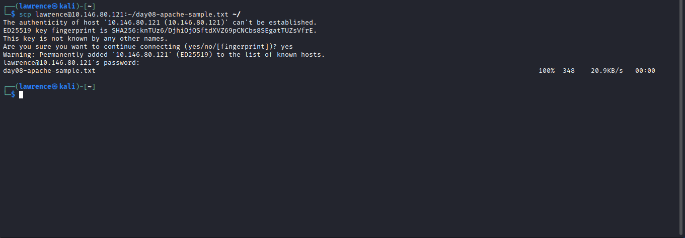

# Day 08 — Log Fundamentals: Timestamps, Formats, and Normalization

## What I Concluded

Today was different from every other day so far. No Wireshark, 
no PCAP files. Just raw logs and trying to understand what 
they're actually saying before any SIEM touches them.

I collected 3 different log types across 3 different machines — 
syslog from Kali, Apache access log from Ubuntu, and Windows 
Security Event Log from my Windows host. Same concept across 
all three: something happened on a machine and the OS wrote 
it down. But the way each one writes it down is completely 
different, and that difference matters a lot in a SOC context.

---

### Log Type 1 — Syslog (Kali Linux)

Collected using:
 sudo journalctl -n 20 --no-pager > ~/day08-syslog-sample.txt



 A typical line looks like this:
 May 20 13:56:15 kali systemd[1]: Started systemd-hostnamed.service

 Breaking it down:
- **May 20 13:56:15** — timestamp. No year, no timezone.
- **kali** — hostname. Which machine generated this.
- **systemd** — process name. What program logged this.
- **[1]** — PID. Process ID.
- **Started systemd-hostnamed.service** — the actual message.

The biggest thing I noticed is that syslog has no timezone 
in the timestamp. It's just local system time with no 
indication of what timezone that is. That's a serious gap. 
If I have two machines in different timezones both generating 
syslog, correlating their events means I have to already know 
each machine's timezone separately. The log itself tells me 
nothing.

One line that stood out from my capture:
    May 20 14:01:08 kali sudo[10397]: lawrence : TTY=pts/0 ;
PWD=/home/lawrence ; USER=root ; COMMAND=/usr/bin/journalctl

That's my own sudo command showing up in the log. In a real 
SOC that line matters — it shows who ran what as root and 
from which directory. If an attacker gets on a machine and 
runs sudo commands, this is exactly what the trail looks like.

---

### Log Type 2 — Apache Access Log (Ubuntu)

Generated by installing Apache on Ubuntu, then using curl to 
simulate different request types:
curl http://localhost              # normal GET - 200
curl http://localhost/doesnotexist # missing page - 404
curl http://localhost/admin        # probing admin panel - 404
curl -A "Mozilla/5.0 Googlebot" http://localhost  # spoofed UA


The log output:
    ::1 - - [20/May/2026:13:36:07 +0100] "GET / HTTP/1.1" 200 10926 "-" "curl/8.5.0"
    ::1 - - [20/May/2026:13:36:44 +0100] "GET /doesnotexist HTTP/1.1" 404 432 "-" "curl/8.5.0"
    ::1 - - [20/May/2026:13:36:56 +0100] "GET /admin HTTP/1.1" 404 432 "-" "curl/8.5.0"
    ::1 - - [20/May/2026:13:38:34 +0100] "GET / HTTP/1.1" 200 10926 "-" "Mozilla/5.0 Googlebot"

Breaking down one line:
- **::1** — Client IP (IPv6 loopback — localhost)
- **-** — Ident (always ignored)
- **-** — Auth user (not logged in)
- **[20/May/2026:13:36:07 +0100]** — Timestamp with timezone
- **"GET / HTTP/1.1"** — HTTP method + URL + version
- **200** — Status code (success)
- **10926** — Bytes sent in response
- **"-"** — Referrer (direct access)
- **"curl/8.5.0"** — User-Agent

Two things that stood out:

First — the timestamp includes +0100 timezone. Already more 
reliable than syslog for correlation.

Second — the Googlebot line. I typed that User-Agent myself 
with curl. The log recorded it exactly as I typed it. Any 
attacker can type anything there and the log will believe it. 
This is the same User-Agent spoofing lesson from Day 6, but 
now I can see it from the server's perspective. The server 
logged "Mozilla/5.0 Googlebot" without questioning it.

The 404 on /admin is also worth noting. In a real environment 
if I saw 50 of those in a row from the same IP — all 404s on 
paths like /admin, /login, /wp-admin — that's directory 
brute-forcing. The individual event looks harmless. The 
pattern is the detection.

---

### Log Type 3 — Windows Security Event Log (Windows Host)

Opened Event Viewer → Windows Logs → Security → filtered for 
Event ID 4624 → copied the XML from the Details tab.


The event:
```xml
<TimeCreated SystemTime="2026-05-20T12:11:09.9991692Z" />
<EventID>4624</EventID>
<EventRecordID>637086</EventRecordID>
<Computer>Lawrence</Computer>
<Data Name="TargetUserName">SYSTEM</Data>
<Data Name="LogonType">5</Data>
<Data Name="ProcessName">C:\Windows\System32\services.exe</Data>
<Data Name="IpAddress">-</Data>
```

Breaking it down:
- **TimeCreated** — UTC ISO 8601 timestamp. Most reliable of 
  all three formats.
- **EventID 4624** — successful logon
- **EventRecordID 637086** — sequential record number. Gaps 
  in this sequence can indicate log tampering.
- **LogonType 5** — service logon (not a human sitting at 
  the keyboard)
- **ProcessName services.exe** — Windows service manager 
  started this session
- **IpAddress -** — local logon, no network source

The XML structure means every field has a name. No guessing 
which position means what like Apache. A SIEM can extract 
`TargetUserName`, `LogonType`, `IpAddress` directly by tag 
name — much cleaner to parse than space-delimited syslog.

---

### Comparing All 3

| | Syslog | Apache | Windows Event |
|---|---|---|---|
| Timestamp format | May 20 13:56:15 | [20/May/2026:13:36:07 +0100] | 2026-05-20T12:11:09.9991692Z |
| Timezone | None | +0100 | UTC (Z) |
| Delimiter | Space | Space + brackets + quotes | XML tags |
| Unique identifier | Hostname + PID | Client IP + timestamp | EventRecordID + EventID |
| Most security-relevant | Message body | Status code + URL + IP | EventID + LogonType |

The timestamp difference is the biggest practical issue. If 
an attacker logs into a Windows machine (Event Log, UTC) and 
then immediately makes a web request hitting an Apache server 
(Apache log, +0100 = WAT), those two events happened at the 
same time but their timestamps are in different formats and 
different timezones. Without normalization, correlating them 
in a SIEM is either manual or wrong.

The most analyst-friendly format is Windows Event Log — UTC 
timestamps, XML structure, named fields, sequential record 
IDs. Syslog is the hardest — no timezone, space delimited, 
message body is freeform text.

---

## Assumption I Made

I assumed all three log types would at least have timestamps 
in a consistent enough format that comparing them would be 
straightforward. That was wrong. The Apache timestamp alone 
has a completely different structure from both syslog and 
Windows. Day/Month/Year:HH:MM:SS +timezone is not the same 
as ISO 8601 and not the same as Month Day HH:MM:SS with no 
year and no timezone.

I also assumed syslog would be the simplest format to read 
since it's plain text. It is readable but it's the most 
dangerous for correlation because the missing timezone is 
invisible — you won't notice the gap until you're trying to 
line up events and they're an hour off.

## Uncertainty I Have

I want to understand what happens in a real SIEM when logs 
from these three sources come in at the same time. Does 
Splunk or Elastic automatically normalize the timestamps to 
UTC on ingestion? Or does the analyst have to configure that 
per source? And if the configuration is wrong — if someone 
set the wrong timezone for the syslog source — would the SIEM 
silently ingest the wrong timestamps without any error?

That's what I want to test when I get to Month 2 SIEM work. 
For now I know the formats well enough to catch the problem 
manually. But I want to see what the automated version looks 
like and where it can fail.