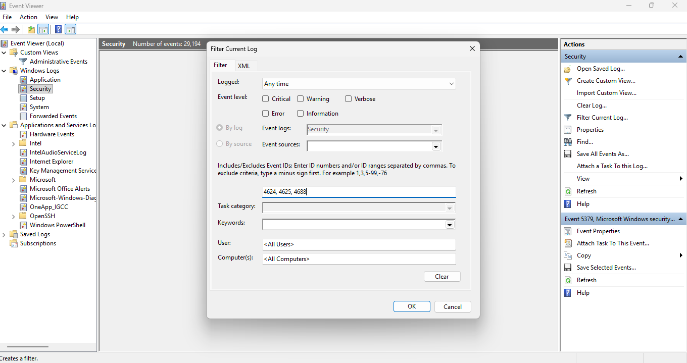
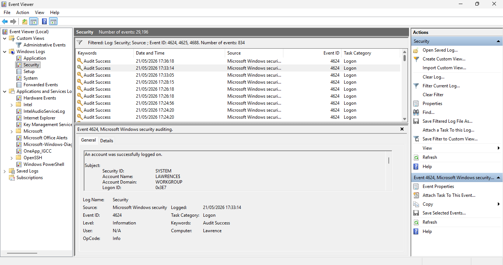
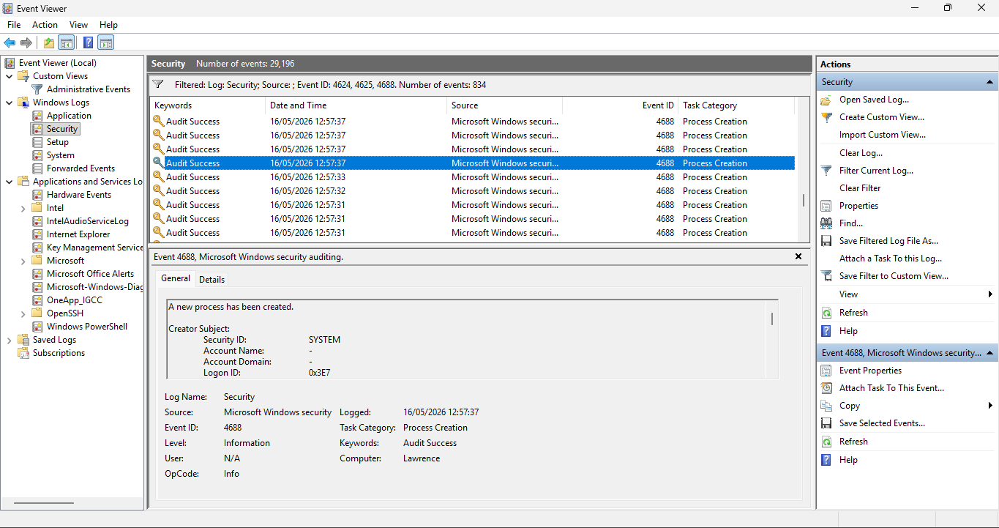

# Day 09 — Windows Event Log Deep Dive

I tried Day 9 by looking at Windows Event Viewer on my laptop. I turned on the setting so process creation events show the full command line. Then I ran a few normal commands and saved the events and some screenshots.

## TL;DR

- I turned on command-line logging for process creation so `4688` shows the full command.
- I ran `ipconfig`, `whoami`, `net user`, `tasklist`, and `systeminfo` and saved the events.
- Exports are in `event-samples/` and the pictures are in `screenshots/`.

## What I did (step by step)

1. Turned on command-line logging for process creation in Event Viewer / audit settings.
2. Ran a few commands from an administrator prompt.
3. Opened Event Viewer and exported the `4624`, `4625`, and `4688` events to the `event-samples/` folder.
4. Took screenshots of the `4688` entries that show the command line and saved them in `screenshots/`.

## Events I saw

- `4624` — Successful logon (who logged in).
- `4625` — Failed logon (when someone tried and failed).
- `4688` — Process creation (this shows the exact command when command-line logging is on).

## What I learned (plain)

- When `4688` has the command line, I can see exactly what someone ran. That helps me know if a command was normal or weird.
- `4624` helps me see which account was used. `4688` helps me see what the account ran.
- If there are failed logons (`4625`) right before a strange `4688`, that looks suspicious and should be checked.

## Files and screenshots

I put everything in the Day 09 folder:

- `month-01/day-09/event-samples/` — exported EVTX/XML files.
- `month-01/day-09/screenshots/` — three screenshots showing `4688` with the command line.

## Next small steps (what I will do next)

- Practice this again and collect more examples (different users and commands).
- If you want, I can make a very simple alert for `4688` that looks for `-EncodedCommand` or long base64 strings and show how to run it in Splunk. Do you want that?

---

Files created/updated during this exercise:

- `month-01/day-09/event-samples/` — exported EVTX/XML examples
- `month-01/day-09/screenshots/` — evidence screenshots

