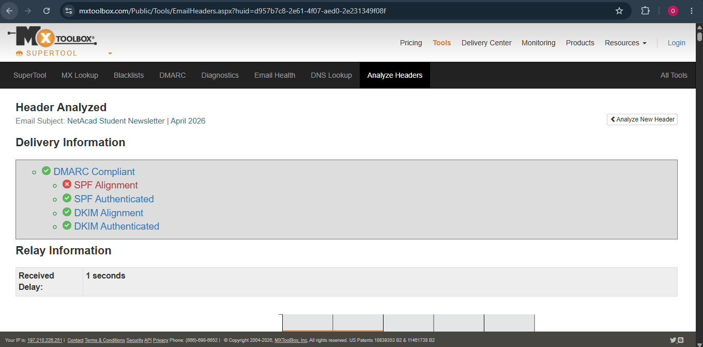
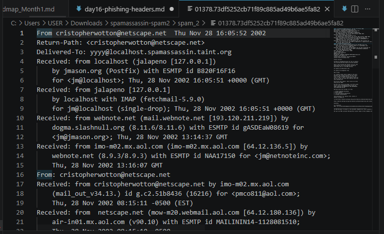
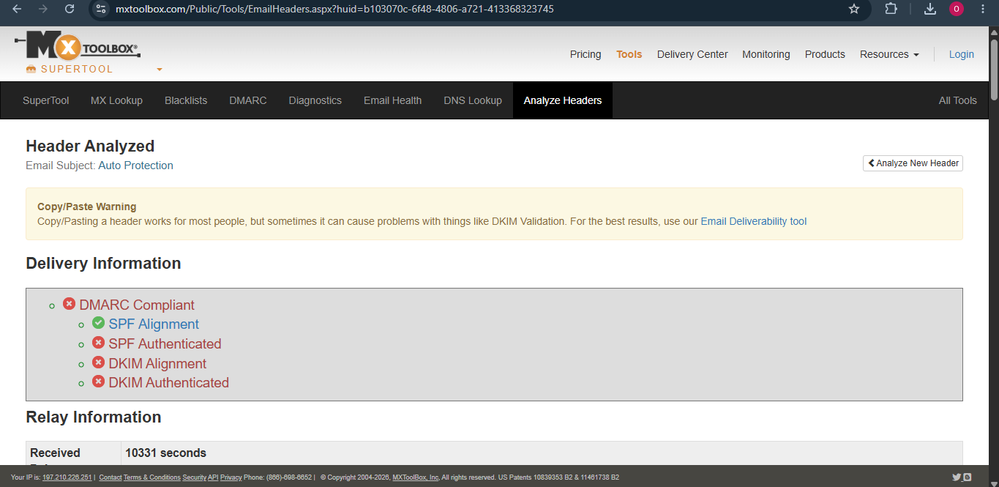

# Day 16 — Phishing Analysis: Header Dissection

## What Today Is About
Phishing triage starts here. The body can lie. The From address can lie. The header chain is where you figure out what *actually happened*.

---

## What I Looked At

3 legit emails from Gmail + 3 spam samples from the SpamAssassin public corpus.

| Sample ID | Type (Legit / Suspicious) | Source | Subject | Claimed From | Return-Path domain | Reply-To domain | My verdict |
|---|---|---|---|---|---|---|---|
| L1 | Legit | Gmail | NetAcad Student Newsletter \| April 2026 | Cisco Networking Academy <netacademail@external.cisco.com> | em-sj-77.mktomail.com | external.cisco.com | Legit newsletter (DMARC passed; vendor sending) |
| L2 | Legit | Gmail | [Newsletter] Netlify is now full-stack | Netlify Team <noreply@netlify.com> | bf53x.hubspotemail.net | netlify.com | Likely legit newsletter |
| L3 | Legit | Gmail | Thanks for joining NEWBIE HIKE WITH IKEM MAZELI | The Hikerstrail Trybe <hikerstrail@calendar.luma-mail.com> | amazonses.calendar.luma-mail.com | gmail.com | Likely legit event email |
| S1 | Suspicious | SpamAssassin corpus | Auto Protection | cristopherwotton@netscape.net | netscape.net | aol.com | Spam/suspicious (Reply-To mismatch + no auth) |
| S2 | Suspicious | SpamAssassin corpus | [ILUG] Prevent Work Monotony ilug | Paula Gaiger <Rocheldy@webinfo.fi> | linux.ie | skynet.csn.ul.ie | Spam/suspicious (no DMARC/SPF/DKIM; list/bulk vibes) |
| S3 | Suspicious | SpamAssassin corpus | Webmaster ganhe dinheiro !!! | "PARQUIEJO DII TROYA" <webmaster@ibest.com.br> | ibest.com.br | ibest.com.br | Spam/suspicious |

---

## What The Headers Said

### Sample L1

This one is legit, but it’s a perfect example of why beginners get tricked:

The brand is Cisco.
The infrastructure is Marketo.
Both can be true.

**Gmail “Show original” auth summary**
- SPF: PASS with IP 199.15.215.34
- DKIM: PASS with domain external.cisco.com
- DMARC: PASS

**Key fields**
- From: Cisco Networking Academy <netacademail@external.cisco.com>
- Reply-To: netacademail@external.cisco.com
- Return-Path: <059-VFZ-834.0.1100893.0.0.34454.9.416187631@em-sj-77.mktomail.com>
- Message-ID: <1519752677.26649269.1777416893751@mlm-mktmail-batch-0001-a-011.prod.ca13.marketo.org>

**Received chain**
The point is clear in the header:
- It came through marketing platform infrastructure.
- Return-Path domain ≠ From domain.

**Auth results (what mattered)**
- SPF: pass (google.com says 059-vfz-834…@em-sj-77.mktomail.com designates 199.15.215.34)
- DKIM: pass (I saw DKIM pass for external.cisco.com; MXToolbox also showed DKIM alignment/authenticated)
- DMARC: pass (MXToolbox shows DMARC compliant)

Extra detail from MXToolbox that mattered:
- DMARC: compliant
- SPF authenticated: yes
- DKIM authenticated: yes
- SPF alignment: failed
- DKIM alignment: passed

**Red flags**
- The only thing that looks “bad” is SPF alignment failed.
- But this is exactly what legit vendor sending looks like.

**My call**
- Legit.
- DKIM alignment is doing the heavy lifting here.
- Return-Path being mktomail.com lines up with a newsletter blast.

---

### Sample L2

This is the same “real company + vendor sending platform” pattern as L1.

The only difference is the vendor:
- Return-Path domain is on HubSpot infrastructure (`hubspotemail.net`).
- From/Reply-To are still Netlify.

**Key fields**
- From: Netlify Team <noreply@netlify.com>
- Reply-To domain: netlify.com
- Return-Path domain: bf53x.hubspotemail.net

---

### Sample L3

Same idea as L2, just a different platform.

Return-Path is Amazon SES (so yeah it looks “different”, but it’s normal for event/email tooling).

**Key fields**
- From: The Hikerstrail Trybe <hikerstrail@calendar.luma-mail.com>
- Reply-To domain: gmail.com
- Return-Path domain: amazonses.calendar.luma-mail.com

---

### Sample S1

This is an old-school spam sample from the corpus. It’s ugly, but it teaches the basics.

**Key fields**
- From: cristopherwotton@netscape.net
- Reply-To: pmco811@aol.com
- Return-Path: <cristopherwotton@netscape.net>

**Received chain (what I saw)**
Multiple hops. You can literally watch it bounce around before local delivery.

Some hops I captured:
- netscape.net / aol webmail infrastructure
- imo-m02.mx.aol.com → webnote.net
- webnote.net → dogma.slashnull.org
- then it gets pulled locally (IMAP/fetchmail) which adds the localhost/127.0.0.1 noise

Hop count: ~6+ `Received:` hops.

**Auth results**
- MXToolbox showed basically no modern auth here (SPF/DKIM not authenticated).
- This is also a 2002-era sample, so that part isn’t shocking.

**Red flags**
- Reply-To domain doesn’t match From (aol.com vs netscape.net).
- No SPF/DKIM/DMARC to lean on.

**My call**
- Spam/suspicious.
- Reply-To mismatch is enough for me to treat it like a trap.

---

### Sample S2

**Key fields (from MXToolbox “Headers Found”)**
- From: Paula Gaiger <Rocheldy@webinfo.fi>
- To: <ilug@skynet.csn.ul.ie>
- Return-Path: <ilug-admin@linux.ie>
- Message-ID: <wuyyyyyaiospc@webinfo.fi>

**Auth results (MXToolbox)**
- DMARC: no record found
- SPF: not authenticated
- DKIM: not authenticated

**Red flags**
- This looks like a bulk/list email (list headers + precedence bulk), which is a perfect place for spam to hide.
- From domain (webinfo.fi) doesn’t match Return-Path/list domain (linux.ie). Could be normal for mailing lists, but it’s still a mismatch worth noting.

**My call**
- Spam/suspicious. Auth didn’t help me, so it comes down to mismatches + the fact it’s literally a spam corpus sample.

---

### Sample S3

Spam sample.

Even without going deep, the subject line is basically “make money!!!” and the sender name is doing the whole edgy “TROYA” thing.
That’s classic spam behavior.

**Key fields**
- From: "PARQUIEJO DII TROYA" <webmaster@ibest.com.br>
- Reply-To domain: ibest.com.br
- Return-Path domain: ibest.com.br

---

## What I Concluded

- The From address is the least trustworthy thing on the page.
- “SPF PASS” is not a magic stamp of legitimacy.
- The L1 Cisco newsletter is a perfect example: it’s legit, but it still uses third-party infrastructure.
	- Return-Path is on mktomail.com (Marketo)
	- SPF can pass for the vendor domain while SPF *alignment* fails for the visible From domain
	- DMARC can still pass because DKIM alignment passes for the From domain
- Older spam samples won’t have modern auth (SPF/DKIM/DMARC), so the header path + mismatches (Reply-To vs From) matter more.

I also wrote myself a checklist so I don’t miss obvious stuff when I’m tired:
- [day16-header-checklist.md](./day16-header-checklist.md)

## Assumption I Made

- I used to read “SPF pass” like “email is legit.” That’s not what it means.
- SPF can pass for the *envelope sender* domain (Return-Path) and still not align with the visible From.

## Uncertainty I Have

- I’m still building instincts on when an SPF alignment fail is “normal vendor sending” vs “someone abusing a legit mail service.”
- Mailing lists make this messy (From can be one domain, list infrastructure another). I need more reps.
