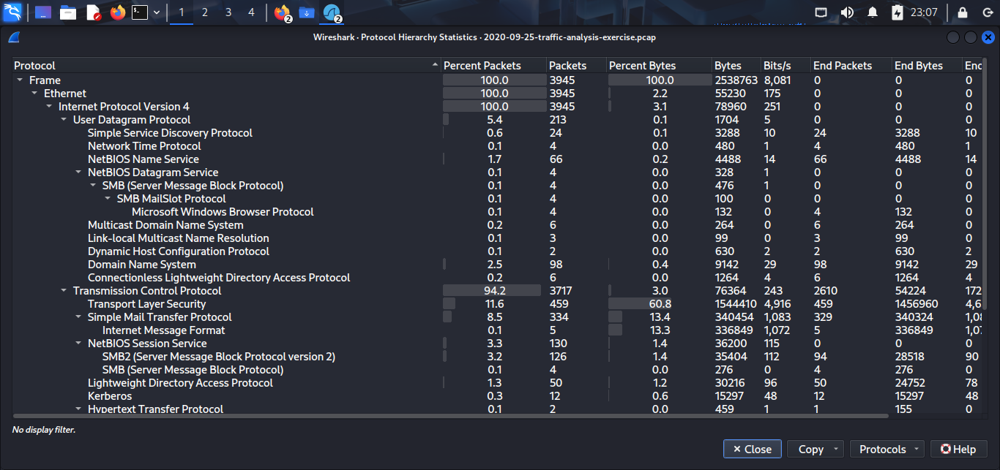
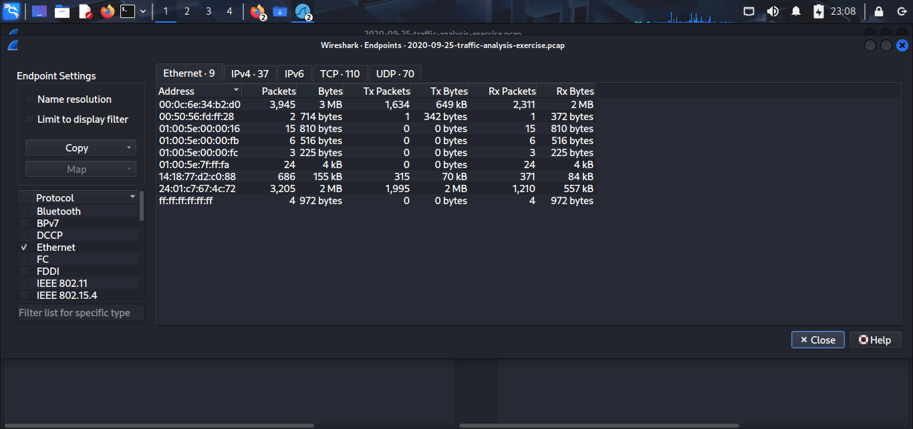
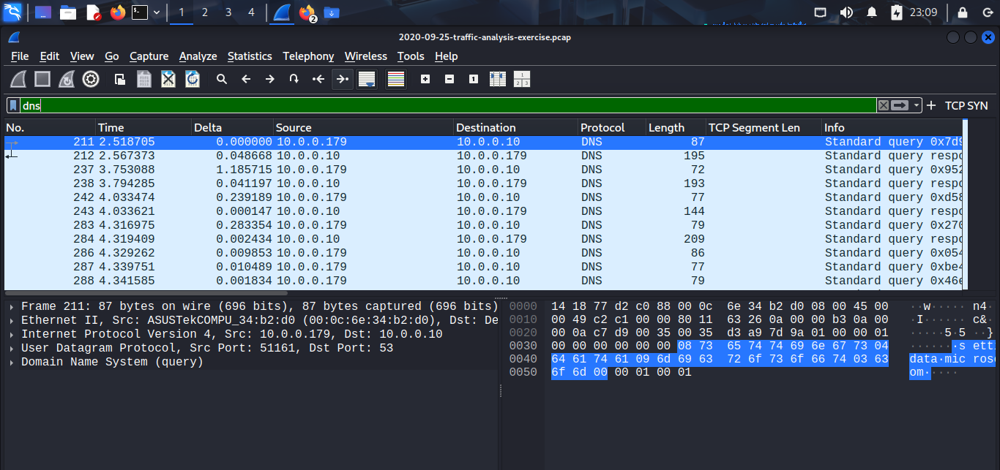
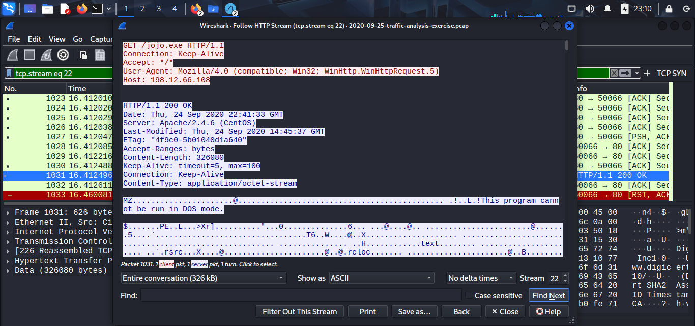
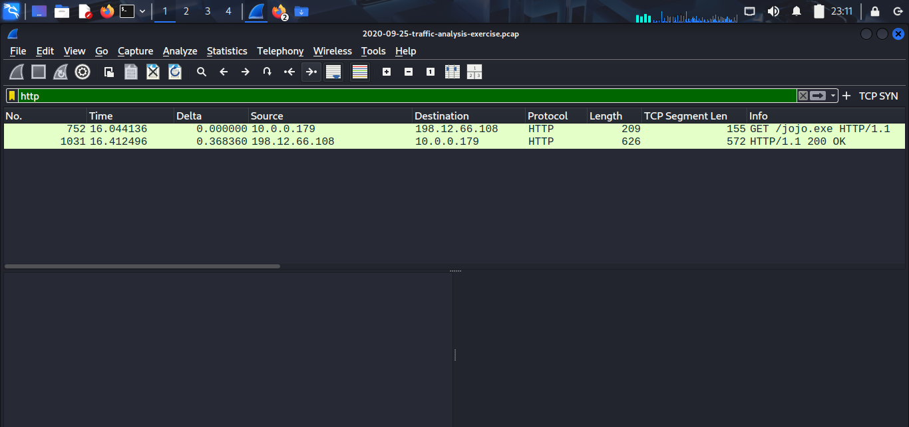

# Day 20 — Network Traffic Analysis

Short mission: analyze provided PCAPs and network telemetry for suspicious activity, extract IOCs, and produce detection guidance.

Key finding: the PCAP contains an HTTP download of a Windows PE file (evidence in the screenshots and full report).

## Files
- [day20-traffic-analysis.md](./day20-traffic-analysis.md)
- [screenshots](./screenshots/)
 - [day20-full-report.md](./day20-full-report.md)
 - [day20-iocs.csv](./day20-iocs.csv)

## Evidence (screenshots)

Below are the key screenshots from the PCAP analysis. They are stored in `./screenshots/` and will render on GitHub.

*Protocol hierarchy — shows high TLS and TCP volume.*

*Endpoints overview — internal vs external hosts and traffic volumes.*

*DNS query examples extracted from the capture.*

*Follow TCP stream — HTTP 200 serving a PE file (MZ header visible).* 

*Packet list — HTTP GET for jojo.exe observed in the capture.*
